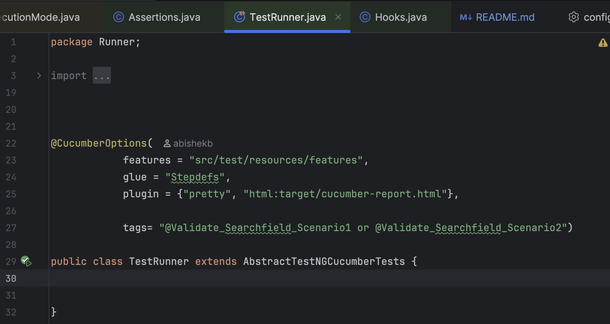
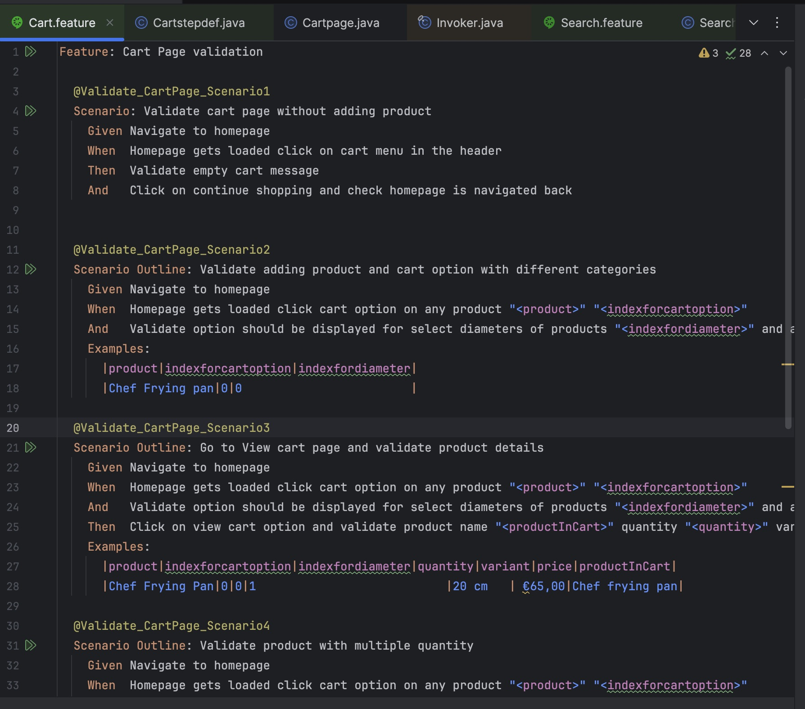

Beka-Ware Automation Framework

**1.Overview**

* BekaWare is a UI automation framework built using Selenium WebDriver, Cucumber BDD, TestNG, and Maven. The framework follows the Page Object Model (POM) design pattern for better maintainability, scalability, and readability.
* The project is designed to automate end-to-end web application with multiple language.

Website URL - www.beka-cookware.com/enite

**2.Tech Stack**
* Framework Design Pattern
* The framework follows:
* Page Object Model (POM)
* Utility-based reusable methods
* Cucumber BDD structure
* Maven project structure

**3.Features Covered**
* Homepage Module
* Homepage loading validation
* Multi language validation
* Navigation validation
* UI element verification
* Product Module
* Product image validation
* Product name validation
* Product description validation
* Product price validation
* Search Module
* Product search validation
* Search suggestions validation
* Search result validations
* Category Module
* Category selection
* Filter validations
* Sub-category validations
* Cart Module
* Add to cart validation
* Cart item verification
* Quantity validations

**3.Prerequisites**
Install the following:
Java 20+
Maven
Chrome Browser
IntelliJ IDEA / Eclipse
Git

**5.Dependencies Used**
* Java 21
* Maven 3.9.0
* Cucumber 7.15.0
* testng 7.9.0
* Selenium-Java 4.23.0

**4.Setup Instructions**

1. Verify Installation
Ensure Java and Maven are correctly installed: java -version mvn -version

2. Clone Repository
git clone cd

3. Open in IDE
Open the project in IntelliJ IDEA / Eclipse
Import it as a Maven project (if not auto-detected)

4. Install Dependencies
mvn clean install

5. Execute Test Suite
Run Complete Suite
mvn test

**5.Run Configuration**
1. Using command line
Go to project folder and open cmd then
Use - > mvn test -Dheadless=false -Dcucumber.filter.tags="@tags"
Examples - @Validate_Searchfield_Scenario1

2. Feature file
Open the desired feature file
Copy the tags and use it in cmd

**6.Cucumber Report**
1. Report generated at:
target/cucumber-report.html

**7.Browser Configuration**
1. Browser initialization handled through:
DriverFactory

2. Supported browsers:
Chrome
Firefox

**8.Wait Strategies Used**
* The framework uses:
* Explicit Wait
* Fluent Wait
* JavaScript Executor Waits
* Utility-based reusable waits

**9.Utilities Included**
* utility.java
* Reusable methods for:
* JavaScript Executor
* Scroll handling
* Mouse actions
* Keyboard actions
* Generic Selenium helpers
* Waitutils.java
* Reusable wait conditions for:
* Visibility
* Clickability
* Invisibility
* Dynamic waits

**10.Hooks Usage**
1. Hooks are implemented using:
@Before & @After

2. Purpose:
Browser setup
Browser teardown
Scenario isolation

**11.Best Practices Followed**
* Page Object Model
* Reusable utility methods
* Separate test data handling
* Clean package structure
* Tag-based execution
* Scalable automation design
